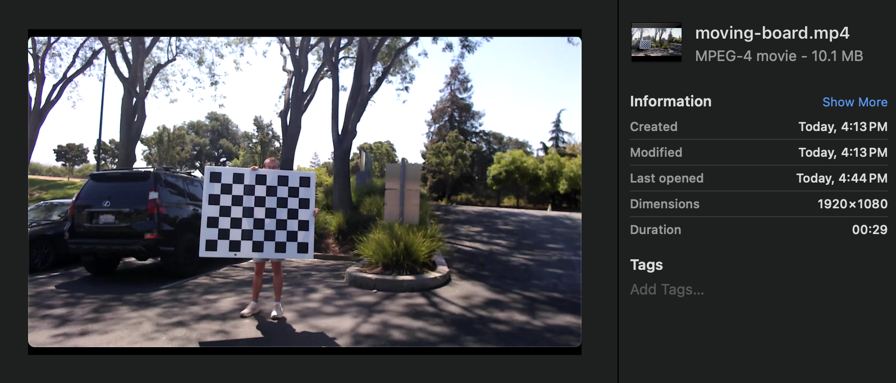
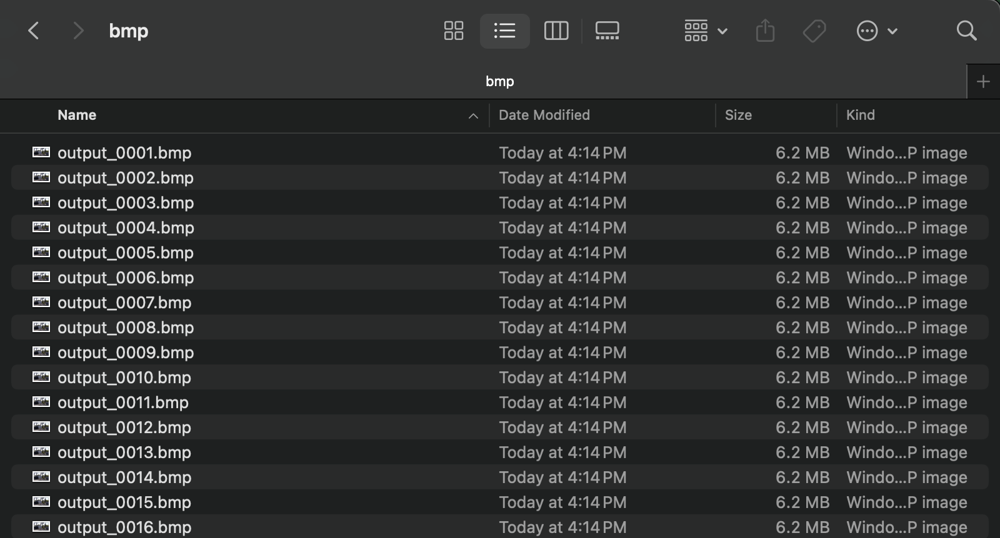
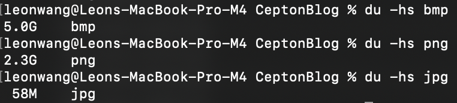
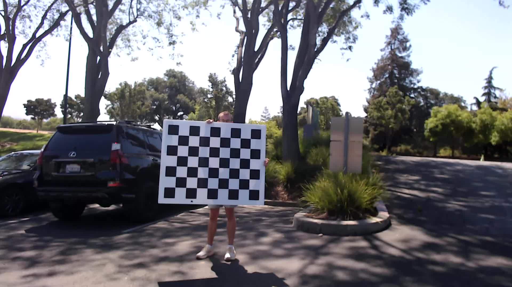

# Lidar Camera Calibration Pipeline

## Introduction

Lidar camera calibration is the process of estimating the pose of a camera relative to a lidar. To achieve this, one must find corresponding points in space between the two perspectives. And the easiest way of getting corresponding points is to locate a object which exists in both viewpoints.

As with any model, the more data points there are, the more accurate it is. There are two simple methods of achieving this:

1. Finding multiple objects in different locations at once
2. Track one object which moves to different locations in time

This blog explains the second method, and the challenges/methodology associated with each step along the way. 

## Part 1: Data and Prerequisites

Before thinking of calibration, one must first consider the form and collection of the data used. The goal is to have many matching lidar and camera frames of the same object in different locations. The simplest solution? A lidar and a camera recordings of the same moving object.

Lidar recording is simple; Cepton already has a well defined architecture for the collection and handling of lidar data.

Camera recording, on the other hand, is unfortunately not trivial. Different camera manufacturers have different SDKs, and most of them don't play well with Rust (the language of choice for Cepton software). Luckily, the camera manufacturer we chose to support, Basler, provided a C++ library which someone wrote a Rust linking wrapper for: [Pylon CXX](https://crates.io/crates/pylon-cxx).

But just having two recordings isn't enough; The lidar and camera data must be synced in some way. Since the object is moving, we need lidar and camera frames of the same timestamp to get corresponding points.

Thus, we require three pieces of data to start calibration:
- A lidar recording
- A camera recording
- Some way of syncing the lidar and camera

For ease of handling and future proofing the data, optimally we can have one piece of data/software which collects and handles all three pieces.

Luckily, there already exists something similar to what we need:

## Part 2: The CR (Cepton Record) Format

The Cepton Record format, was written for this exact purpose: To collect multiple streams of data and combine it into one `.cr` file. It supports streams of lidar frames, images, and also IMU data.

Perfect right? But theres one catch: the CR format supports *images*, not *videos*. This means that in order to utilize the existing CR format framework, one must write every single image for every camera frame to the resulting file. Optimally, for machine learning purposes, we want to support video frames which are both frequent and high resolution. But both of these factors make it extremely space intensive to write every single camera image.
### Ex: Why Writing Individual Frames Isn't Feasible
Let's start with theoretical math.

With the Basler acA2440-20gm we can get up to 2448 x 2048 frames at 23 fps.

At no image compression (writing `.bmp` files), a `.cr` of a ~15 second recording would be estimated to look something like this:

$\pu{15 sec} \times \pu{23 frames/sec} \times \pu{{(2448 \times 2048)} pixels/frame} \times \pu{24 bits/pixel} = \pu{{41511813120} bits}$
$\pu{{41511813120} bits} = \pu{{5188976640} bytes} \approx \pu{{5189} MB}$

Yikes. 5 gigabytes for a 15 second recording. Not to mention that this is an underestimate; We're not even taking into account the size of the bitmap header.

We can try compressing the image to different formats, like `.jpg`. Assuming an extremely generous 50 to 1 compression ratio (in practice its closer to 10:1 or 20:1), we get:

$\pu{{5189} MB} \times \frac{1}{50} \approx \pu{{104} MB}$

Definitely better. But compressing images comes with their own problem too: Image compression takes time, and is difficult to make fast enough to match the frames per second. This means we end up with a backlog which grows the longer we record (eating up memory and performance).

In comparison, a `.mp4` is usually magnitudes smaller than the jpgs: Video formats (like `.mp4`) get most of their space savings due to their ability to encode differences between adjacent frames rather than the entire frame itself. However, theres no simple deterministic math to back it up, so instead an example will be

Here is a 30 second video of a moving chessboard:

Its 10.1 MB.

Using ffmpeg, the video is split it into separate images, one for every frame. This is done three times, with the images being in the formats `.bmp`, `.png`, and `.jpg`. Each time the resulting images are put in a folder named bmp, png, and jpg respectively.

Here is the bmp folder for reference:

Now, here are the sizes of the resulting splits:

Surprisingly, jpg compression is much better than expected. However, it is still 7x larger than the mp4. Not to mention, the compressed images had a noticeable drop in quality.

Hopefully this example illustrates why writing separate images is an issue.

Now, the solution to this is surprisingly simple: Just use videos. They are better in both space efficiency and accessibility.

Now the challenge is modifying the `.cr` file reading and writing to support videos. Simply writing the entire `.mp4` into the `.cr` is both clunky and also hard to validate. Not to mention, we'll need to write a `.mp4` parser if we want to efficiently read the video(s) from and to part(s) of a `.cr` file, which is outside of the scope of this task (the `.mp4` is complicated).

Let's take a step back and look at the third piece of data, the offset. Notice that one will never have an offset without a corresponding video. What if each offset record also came with a relative file path to a `.mp4` file written outside the `.cr`?

Unfortunately, this solution means compromising on the original goal of not having multiple files. But, with the `.mp4`s separate from the `cr`, we get ease of parsing, easier data validation (you can just open up the `.mp4` manually), and also possibly most importantly: we save development time. As such, this is the solution we chose.

## Part 3: Recording Data

The Cepton Record format contains a corresponding Rust tool: Cepton Record Recorder, which already supports recording with lidar and IMU. Modifying it to support camera as well is not too difficult with the existence of the previously mentioned [Pylon CXX](https://crates.io/crates/pylon-cxx).

Multiple issues were encountered, however. First is that Pylon only supports the fetching and writing each frame's image when recording. However, there are already exist tools that exist to turn images into video. Using [ffmpeg](https://ffmpeg.org) through the [ffmpeg-sidecar](https://crates.io/crates/ffmpeg-sidecar) crate, we can write a camera's separate image frames into one aggregate `.mp4` at a speed which keeps up with the frame rate.

The second issue is related to time syncing. Since we only record the offset between the beginning of the video and the lidar, we need to accurately determine the time between a frame and the start of the recording. For the lidar; Every piece of lidar data has it's own accurate timestamp. For the video, it has a constant frame rate, which means each frame must be of equidistant time to each other. The camera has a constant frame rate as well, so this shouldn't be a problem, right? Unfortunately the problem arises when one realizes the fetching of images isn't completely consistent; Every once in a while there will be a frame which is "dropped" (not received). Thus, we need a way to "fill" in the gaps.

The solution implemented is surprisingly simple; Assume the fetching of images is at an entirely arbitrary rate, and at every timestamp where we expect a frame, we write the most recently fetched frame instead.

[TODO: Illustration]

The loss of time precision caused by this method is mostly negligible, due to the fact that the video has a much higher FPS than the lidar, and we only need a video frame every time we have a lidar frame.

[TODO] (explain the math?)

## Part 4: Lidar Camera Calibration

With a two recordings and an offset, we can finally feed the info into a pipeline which takes corresponding frames, finds a common object, and then finds the pose of the camera. While the pipeline which actually reads in the recordings and matches the frames by timestamps isn't actually complete yet, a basic version of the calibration pipeline has been written.

Andrew Lauer has already written an excellent explanation on how this calibration is done in the readme of repository [ceptontech/lidar_camera_calibration](https://github.com/ceptontech/lidar_camera_calibration). The following contains a summary of the methodology of such a process:

Lidar camera calibration is the process of finding the projection matrix $P$, a 3 by 4 matrix that projects a 3d world point $X_i$ to a 2d image point $x_i$ in a camera. The projection matrix also encodes useful information about the position of the camera and the camera itself. World and image points are expressed in homogenous coordinates.

The process starts by matching 2d points in the image to corresponding 3d points in the point cloud. This can be done using any standard method using chessboards, fiducial markers, or feature detection. However, since the point cloud contains 3d information, the points must be projected to a plane, similar to a camera. The following equation shows how the projection matrix relates world points to image points.

$$PX_i = x_i$$

$$\begin{bmatrix}p_{11} & p_{12} & p_{13} & p_{14} \\\ p_{21} & p_{22}  & p_{23} & p_{24} \\\ p_{31} & p_{32}  & p_{33} & p_{34}\end{bmatrix}\begin{bmatrix}X \\\ Y \\\ Z \\\ 1\end{bmatrix}=\begin{bmatrix}u\\\ v\\\ 1 \end{bmatrix}$$

This can be rewritten to express the image point as follows:

$$x_i = \begin{bmatrix}\frac{p_1^TX_i}{p_3^TX_i}\\\ \frac{p_2^TX_i}{p_3^TX_i}\\\ 1\end{bmatrix}=\begin{bmatrix}u\\\ v\\\ 1\end{bmatrix}$$

And then for each world/image pair:

$$p_1^TX_i-u_ip_3^TX_i=0$$

$$p_2^TX_i-v_ip_3^TX_i=0$$

Doing this for all pairs of world and image points, we can construct the matrix A as follows:

$$A \vec{p} = \begin{bmatrix} X_1^T & \vec{0} & -X_1^Tu_1 \\\ \vec{0} & X_1^T & -X_1^Tv_1 \\\ \vdots & \vdots & \vdots \\\ X_n^T & \vec{0} & -X_n^Tu_n \\\ \vec{0} & X_n^T & -X_n^Tv_n \end{bmatrix}_{\text{2nx12}} \begin{bmatrix} \vec{p_1} \\\ \vec{p_2} \\\ \vec{p_3} \end{bmatrix} = \begin{bmatrix} 0 \\\ 0 \\\ \vdots \\\ 0 \\\ 0 \end{bmatrix}$$

Applying SVD to $A$ gives us an initial guess for $p$ that minimizes the $Ap$ product. I.e. $p\in Null(A)$.

This guess can be improved by applying the Levenberg-Marquardt non-linear iterative least squares method. The cost function for the LM optimization is the distance between the ground truth image points and the 3d points projected into the image plane.

Once a good estimation for $P$ has been found, the camera intrinsics, rotation, and translation matrices can be found by decomposing the projection matrix with RQ decomposition. This is a straight-forward decomposition, since the projection matrix is defined by:

$$P = K[R|t]$$

## Part 5: Usage
